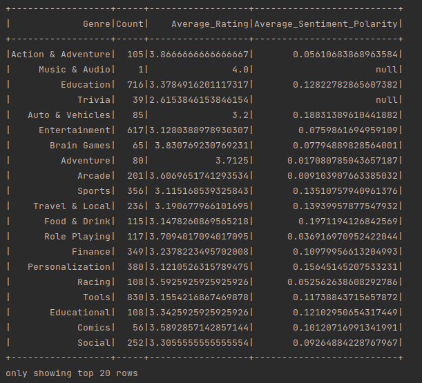
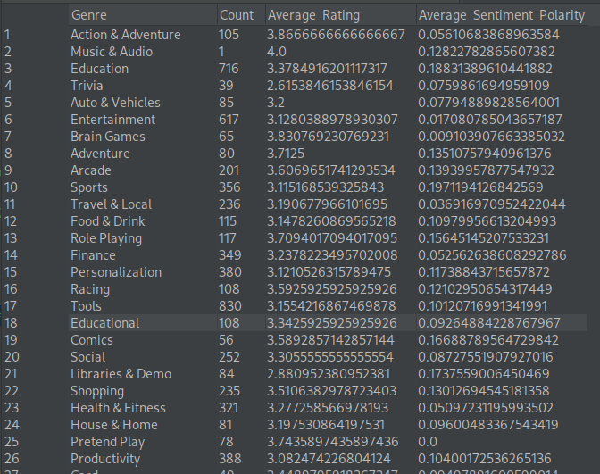

# Spark-2-Challenge

[Challenge Link](https://github.com/bdu-xpand-it/BDU-Recruitment-Challenges/wiki/Spark-2-Recruitment-Challenge)

## Setup

- Spark Instalation - <https://www.tutorialspoint.com/apache_spark/apache_spark_installation.htm>

- Spark setup - <https://sparkbyexamples.com/spark/spark-setup-run-with-scala-intellij/>

- Spark Create DF - <https://sparkbyexamples.com/spark/different-ways-to-create-a-spark-dataframe/>

- Spark DF - <https://spark.apache.org/docs/2.2.0/sql-programming-guide.html>

## Part 1

- Spark DF Operations - <https://www.educba.com/spark-dataframe/>

- Change DF collumn type - <https://sparkbyexamples.com/spark/spark-change-dataframe-column-type/>

- Fill nan in DF - <https://stackoverflow.com/questions/43844389/spark-replace-all-nans-to-null-in-dataframe-api>

- Replace Columns - <https://stackoverflow.com/questions/56557771/use-map-to-replace-column-values-in-spark>

- Rename Columns - <https://stackoverflow.com/questions/35592917/renaming-column-names-of-a-dataframe-in-spark-scala>

## Part 2

- Spark write to CSV - <https://sparkbyexamples.com/spark/spark-write-dataframe-to-csv-file/>

- Spark Sort - <https://sparkbyexamples.com/spark/spark-sort-column-in-descending-order/>

## Part 3

- Join two DF - <https://stackoverflow.com/questions/53872107/merge-two-spark-dataframes-based-on-a-column>

- Date Format - <https://sparkbyexamples.com/spark/spark-sql-date-and-time-functions/#date_format>

## Part 4

- Spark Parquet Save - <https://stackoverflow.com/questions/51628958/spark-savewrite-parquet-only-one-file>

- Spark Save Docs - <https://spark.apache.org/docs/3.1.2/api/scala/org/apache/spark/sql/DataFrameWriter.html>

## Part 5

## Prints

- Part 1

 

 

- Part 2

 

CSV Start

CSV End

 

- Part 3

 

 

- Part 4

 

Parquet

DF

 

- Part 5

 

DF

Parquet

